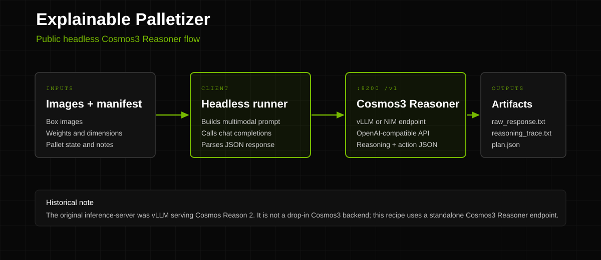

# See How It Thinks: Mixed Palletizing with Explainable Visual Reasoning

This cookbook shows how to validate an explainable mixed-SKU palletizing workflow
with Cosmos3-Nano or Cosmos3-Super. The live Cosmos3 path uses a Diffusers-backed
generation endpoint to create auditable palletizing-scene outputs, while the
Doosan Robotics reference stack provides the full Isaac Sim, cuRobo, FastAPI,
and React control-loop smoke test.

| Model | Workload | Use case |
| --- | --- | --- |
| [Cosmos3-Nano](https://huggingface.co/nvidia/Cosmos3-Nano), [Cosmos3-Super](https://huggingface.co/nvidia/Cosmos3-Super), [Isaac Sim](https://developer.nvidia.com/isaac-sim), [cuRobo](https://curobo.org/), [Diffusers](https://github.com/huggingface/diffusers) | End-to-end | Explainable mixed-SKU palletizing: visual scene generation, handling-policy validation, and simulated robot execution |

**Source project:** [doosan-robotics/explainable-palletizer](https://github.com/doosan-robotics/explainable-palletizer)

## What You Will Build

- Run a Cosmos3-Nano or Cosmos3-Super Diffusers smoke request for a palletizing
  cell and save the generated media artifact.
- Validate the Doosan reference stack with real Isaac Sim, cuRobo, and a
  Cosmos3-Nano Reasoner endpoint that can populate the reasoning and action
  panels.
- Use the same prompt family to document why the system places, delays, or routes
  boxes for human inspection.
- Review the source project's damaged-carton, heavy-box, and mixed-SKU
  walkthroughs in [workflow_e2e.md](workflow_e2e.md).

## Prerequisites

- Follow the shared [Diffusers setup](../README.md#diffusers) if you are
  running Cosmos3 locally.
- For the Doosan reference stack, install Docker with Compose V2 and the NVIDIA
  Container Toolkit on a Linux GPU host.
- Install [`uv`](https://docs.astral.sh/uv/) for the Doosan full-stack smoke if
  the source checkout needs to generate `uv.lock`.
- For full Cosmos3 model runs, authenticate to Hugging Face and accept the
  relevant Cosmos3 model licenses.
- Use a host with enough VRAM for the selected model size.

| Profile | Model | Suggested hardware | Notes |
| --- | --- | --- | --- |
| Nano | `nvidia/Cosmos3-Nano` | Single NVIDIA GB10, RTX 4090-class, or larger GPU | Default for smoke tests and widest accessibility |
| Super | `nvidia/Cosmos3-Super` | Multi-GPU Hopper/Blackwell-class system | Higher quality; launch the serving backend with the Super checkpoint before running the same client request |

## Backends

| Backend | Entry point | GPU requirement |
| --- | --- | --- |
| Diffusers-compatible HTTP endpoint | [`run_palletizer_with_diffusers.md`](run_palletizer_with_diffusers.md) | Nano: single GPU; Super: multi-GPU |
| Doosan reference stack | Cosmos3-Nano Reasoner endpoint plus the source repo app stack | NVIDIA GPU with Isaac Sim support |

## Quick Start

Use the Diffusers entry point first. It is the fastest way to confirm that the
Cosmos3-Nano or Cosmos3-Super service is reachable and can produce a palletizing
scene artifact:

```bash
cd cookbooks/cosmos3/explainable-palletizer
export COSMOS3_DIFFUSERS_BASE_URL=http://127.0.0.1:8000
curl -fsS "${COSMOS3_DIFFUSERS_BASE_URL}/health"
curl -fsS "${COSMOS3_DIFFUSERS_BASE_URL}/v1/models"
```

Then run the Python smoke-test block in
[`run_palletizer_with_diffusers.md`](run_palletizer_with_diffusers.md) to write a
local media artifact and verify the response can be decoded. Use
[workflow_e2e.md](workflow_e2e.md) to compare the generated artifact against the
operator-review criteria from the reference palletizer scenarios.

Then run the full-stack reference smoke on a GPU host. Use Cosmos3-Nano
Reasoner for any test that is expected to populate the reasoning and action UI.
The source repo's `docker-compose.test.yml` swaps in `facebook/opt-125m`; that
path is useful for container health checks only and should not be counted as a
reasoning smoke because the app requests more completion tokens than the tiny
model's 512-token context permits.

```bash
git clone https://github.com/doosan-robotics/explainable-palletizer.git
cd explainable-palletizer
cp docker/.env.example docker/.env
test -f uv.lock || uv lock
```

Start an OpenAI-compatible Cosmos3-Nano Reasoner server with either vLLM or NIM:

- vLLM serves model ID `nvidia/Cosmos3-Nano` with the
  `Cosmos3ReasonerForConditionalGeneration` architecture override.
- NIM serves model ID `nvidia/cosmos3-nano-reasoner` with
  `NIM_MODEL_SIZE=nano`.

Follow the shared [vLLM Reasoner setup](../README.md#vllm) or
[NIM Reasoner setup](../README.md#nim), then configure the Doosan app server to
point at that `/v1` endpoint. Keep `MAX_COMPLETION_TOKENS` below the served
model's context budget.

The current upstream Dockerfile expects `uv.lock`; generate it once with
`uv lock` if the source checkout does not already include it. Change `SIM_PORT`,
`INFERENCE_PORT`, `APP_PORT`, and `FRONTEND_PORT` in `docker/.env` if another
local service already uses the defaults. See
[`run_palletizer_with_diffusers.md`](run_palletizer_with_diffusers.md#full-stack-troubleshooting)
for NVIDIA Docker runtime setup, single-GPU sequential startup, and the cuRobo
`warp-lang` compatibility note.

## Architecture

<p align="center">
  
</p>

The Doosan reference stack launches four services:

| Service | Default port | Role |
| --- | --- | --- |
| `sim-server` | 8100 | Runs Isaac Sim headlessly, creates conveyor-box images, and executes cuRobo-planned pick/place trajectories |
| `inference-server` | 8200 | Serves the model endpoint used by the application server |
| `app-server` | 8000 | Builds prompts, parses structured actions, maintains pallet state, and streams events |
| `frontend` | 3000 | Shows camera frames, reasoning, parsed actions, and execution status |

For the Cosmos3 Diffusers path, the client only needs an HTTP endpoint exposing:

- `GET /health`
- `GET /v1/models`
- `POST /v1/infer`

The request is model-size agnostic. To move from Nano to Super, start the serving
backend with `nvidia/Cosmos3-Super` and confirm `/v1/models` reports the Super
checkpoint before reusing the same prompt and payload shape.

## Results / Expected Output

A successful Diffusers smoke test writes one generated image or video artifact
and prints metadata similar to:

```text
model: nvidia/Cosmos3-Nano
backend: diffusers
decoded media bytes: non-zero
seed: fixed integer
```

A successful full-stack Doosan reasoning smoke test prints healthy endpoints for:

- `sim-server`
- a Cosmos3-Nano Reasoner OpenAI-compatible endpoint
- `app-server`
- `frontend`

and exposes the UI at the configured frontend port with non-empty reasoning and
action panels. If the stack is running with `facebook/opt-125m`, the UI can show
camera frames and boxes, but "No reasoning yet" is expected because that
health-only model rejects the default `max_tokens=2048` request when its context
limit is `512`.

The companion walkthrough includes expected actions and screenshots for:

- damaged cartons routed to `CALL_A_HUMAN`,
- heavy boxes placed on low pallet layers with firm grip,
- mixed-SKU stacks that keep rigid goods below fragile items.

## Dataset

| Name | Source | License | Size |
| --- | --- | --- | --- |
| Synthetic palletizing scenes and box assets | [doosan-robotics/explainable-palletizer](https://github.com/doosan-robotics/explainable-palletizer) | See upstream repository | Small source assets plus Docker/model caches |
| Cosmos3 models | [NVIDIA Cosmos3 collection](https://huggingface.co/collections/nvidia/cosmos3) | NVIDIA Open Model License | Varies by model |

## Safety and Limitations

- This is a simulated proof of concept, not a production robot safety system.
- Cosmos3 generation can help validate scene prompts and expected outputs, but
  real palletizing deployments still need independent safety controls, guarded
  robot execution, and site-specific validation.
- The upstream Doosan project currently keeps its full closed-loop stack in the
  public reference repository; this cookbook does not vendor that source code.
- If the full-stack smoke test fails on a driver, CUDA, or container-runtime
  mismatch, fix the host runtime before treating the robot-loop path as passed.
- If the Diffusers endpoint was just restarted, the first Nano/Super request can
  spend several minutes loading weights before returning a generated artifact.

## Resources

- [doosan-robotics/explainable-palletizer](https://github.com/doosan-robotics/explainable-palletizer)
- [Cosmos3-Nano](https://huggingface.co/nvidia/Cosmos3-Nano)
- [Cosmos3-Super](https://huggingface.co/nvidia/Cosmos3-Super)
- [Cosmos3 Diffusers setup](../README.md#diffusers)
- [Isaac Sim](https://developer.nvidia.com/isaac-sim)
- [cuRobo](https://curobo.org/)
