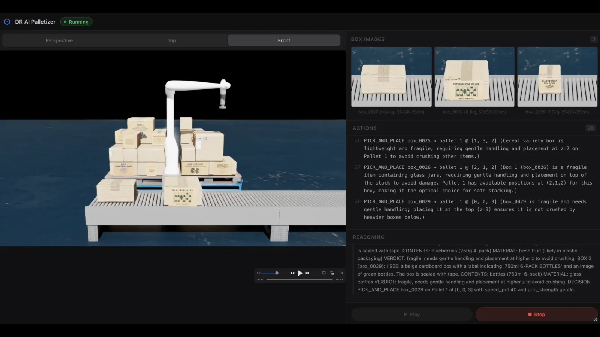

# Decision Walkthrough and Validation Criteria

This companion guide adapts the explainable-palletizer walkthrough from the
source project for the Cosmos3 cookbook layout. Use it after the quick Diffusers
smoke test in [run_palletizer_with_diffusers.md](run_palletizer_with_diffusers.md)
to understand what a useful palletizing-scene artifact or full-stack robot-loop
run should make visible.

The original Doosan Robotics proof of concept was built for a Cosmos Cookoff
reasoning demo. This cookbook uses Cosmos3-Nano as the default generation
profile and Cosmos3-Super as the higher-quality generation profile. The
Cosmos3 Diffusers path validates palletizing scene prompts, model identity,
fixed seeds, and generated media artifacts. For the operator UI's reasoning and
action panels, run the Doosan reference stack against a Cosmos3-Nano Reasoner
OpenAI-compatible endpoint.

## Model Profiles

| Profile | Model | Purpose |
| --- | --- | --- |
| Nano | `nvidia/Cosmos3-Nano` | Default smoke-test profile for low-cost palletizing-scene artifact generation |
| Super | `nvidia/Cosmos3-Super` | Higher-quality profile for final prompt review and richer generated artifacts |

Both profiles use the same HTTP client shape in this cookbook:

- `GET /health`
- `GET /v1/models`
- `POST /v1/infer`

The model is selected by the running server. Always check `/v1/models` before
the generation request and record the returned model ID with the output
artifact.

## Reference Control Loop

The Doosan stack is a four-service reference system:

| Service | Default port | Role |
| --- | --- | --- |
| `sim-server` | 8100 | Runs Isaac Sim headlessly, creates conveyor-box images, and executes cuRobo-planned pick/place trajectories |
| `inference-server` | 8200 | Serves a Cosmos3-Nano Reasoner endpoint for reasoning/action generation |
| `app-server` | 8000 | Builds prompts, parses structured actions, maintains pallet state, and streams events |
| `frontend` | 3000 | Shows camera frames, rationales, parsed actions, and execution status |

The control loop is intentionally auditable:

1. `sim-server` keeps a conveyor buffer populated with visible boxes.
2. `app-server` requests box images, dimensions, pallet state, and valid
   placement cells.
3. `app-server` sends the prompt to the inference endpoint.
4. The response is parsed into a bounded action contract.
5. `app-server` validates the action against pallet constraints.
6. `sim-server` plans and executes the simulated robot motion.

The Cosmos3 Diffusers smoke test does not replace the robot action parser. It
creates visual evidence for palletizing prompts, scene constraints, and
operator-review criteria before or alongside the full-stack robot smoke path.

## Cosmos3 Full-Stack Smoke Evidence

The default full-stack recipe mode is a Cosmos3-Nano action smoke with verbose
reasoning not required as a pass condition. Set `PALLETIZER_REASONING_MODE=on`
only when the validation target includes the visible reasoning trace itself. In
both recipe modes, do not stop at `docker compose ps` or `/api/status`. The UI
can be healthy while the model path is wrong if the app still points at the test
compose stub. A valid Cosmos3-Nano Reasoner smoke has all of this evidence:

- `/v1/models` on the Reasoner endpoint returns `nvidia/Cosmos3-Nano`.
- `app-server` is configured with `INFERENCE_SERVER_URL` pointing at that
  Reasoner endpoint's `/v1` base URL.
- `app-server` logs contain a successful
  `POST ... /v1/chat/completions "HTTP/1.1 200 OK"`.
- The raw response is parsed into one of the bounded actions. In
  `PALLETIZER_REASONING_MODE=on`, it should also contain visual inspection or
  `<think>` text for operator review.
- The logs contain an execution line such as
  `Executing: action=PICK_AND_PLACE box_id=box_0001 ...` or an explicit
  `CALL_A_HUMAN` action for unsafe boxes.
- `STEP_LOG_DIR` contains per-step `scenario.txt`, `response.txt`,
  `action.json`, and the box image files sent to the Reasoner.

Example action artifact from a passing Nano Reasoner step:

```json
{
  "action": "PICK_AND_PLACE",
  "box_id": "box_0001",
  "target_pallet": 1,
  "position": [0, 0, 1],
  "speed_pct": 100,
  "grip_strength": "standard",
  "reason": "Intact sturdy box placed on a valid stable pallet cell."
}
```

If the first model response contains a long reasoning block but no complete JSON
object, the app may request a continuation. Count the smoke as passing only when
the continuation produces a parsed action and the simulator accepts the action
or the UI records a deliberate human-escalation event.

If reasoning is visible but the action list does not advance, inspect the saved
`response.txt` for that step. A response that ends inside `<answer>` or midway
through a JSON field means the model completed the visual audit but hit the
completion-token limit before emitting a parseable action. Raise
`MAX_COMPLETION_TOKENS` to at least `1024` for Cosmos3-Nano Reasoner and rerun
the app-server smoke. This is a reference-app/parser setup issue rather than a
Cosmos3 service availability issue.

If the response parsed and the UI shows one action after a multi-box reasoning
trace, that can still be correct: the reference loop reasons over the front
buffer window and emits one action per iteration. The full-stack smoke is
blocked only if execution fails after the action handoff. Check `app-server`
and `sim-server` logs for `POST ... /sim/robot/pick_place` failures such as
`pick_and_place RESPONSE 500` with `NoneType` details, and check
`/sim/buffer/status` for a partially popped buffer like
`{"occupied":2,"slots":[0,1,1],"in_transit":false}`. In that case, reset and
restart the control loop before retesting. If the same `pick_place` 500
reproduces after a clean reset, record the robot-loop path as blocked by the
Isaac Sim/cuRobo setup and do not treat it as a Cosmos3 reasoning failure.

Because prompt shape and token count cannot fully guarantee parseable JSON from
a free-form reasoning response, keep the default action smoke as the PR/CI gate
unless the goal is specifically to inspect Cosmos3 visual reasoning.

## Action Contract

The reference app accepts three action types:

| Action | Required fields | Meaning |
| --- | --- | --- |
| `PICK_AND_PLACE` | `box`, `target_pallet`, `position`, `speed_pct`, `grip_strength`, `reason` | Pick one visible box and place it at a valid pallet position |
| `CALL_A_HUMAN` | `boxes`, `reason` | Remove damaged, contaminated, unsealed, or otherwise unsafe boxes for inspection |
| `WAIT` | `reason` | Wait only when too few boxes are visible and no safe placement or human call is appropriate |

`PICK_AND_PLACE` is constrained by the prompt and by parser-side validation:

| Field | Type | Allowed values |
| --- | --- | --- |
| `box` | string | One of the visible box IDs, such as `box_0001` |
| `target_pallet` | integer | `1` or `2` |
| `position` | `[x, y, z]` | One of the precomputed valid positions for the selected box and pallet |
| `speed_pct` | integer | `40`, `80`, or `100` |
| `grip_strength` | string | `standard`, `gentle`, or `firm` |
| `reason` | string | Brief operator-visible rationale |

The important safety property is that placement positions are not invented by
the model. The app computes valid positions from pallet occupancy and stability
rules, then the response must select one of those legal positions.

## Scenario 1: Damaged Carton

**Expected action:** `CALL_A_HUMAN`

Three boxes arrive together. Two are visibly unsafe: one has an open top flap
with detached tape, and another is crushed and deformed. The intact box should
not cause the app to ignore the unsafe buffer state.

| Field | Value |
| --- | --- |
| Visible boxes | `box_0000`, `box_0001`, `box_0002` |
| Visible condition | `box_0000`: open flap, detached tape; `box_0001`: intact; `box_0002`: crushed, deformed |
| Pallet state | Partial fill |
| Valid placement cells | Available, but unsafe boxes should block the pick |

Operator-visible rationale:

```text
box_0000 has open flaps and detached tape. box_0002 is crushed and deformed.
Escalate both boxes for inspection before continuing placement from a clean
buffer.
```

Parsed action:

```json
{
  "action": "CALL_A_HUMAN",
  "boxes": ["box_0000", "box_0002"],
  "reason": "box_0000 has open flaps and detached tape, box_0002 is crushed and deformed"
}
```

Simulated outcome: no pick attempt. `app-server` emits a `CALL_A_HUMAN` event,
the UI flags the damaged boxes, and the conveyor advances after operator
inspection.

<p align="center">
  
</p>

## Scenario 2: Heavy Appliance Box

**Expected action:** `PICK_AND_PLACE` at a low `z` position with a firm grip.

Three intact heavy or sturdy boxes arrive together: a metal tool set, a
36-can case of canned beans, and a 25 kg set of rubber-coated weight plates.
Both pallets are empty, so the first heavy box can seed the base layer.

| Field | Value |
| --- | --- |
| Visible boxes | `box_0001` (tool set), `box_0003` (canned beans), `box_0004` (weight plates) |
| Dimensions | `box_0001`: 2 x 2 x 2; `box_0003`: 2 x 2 x 1; `box_0004`: 2 x 2 x 2 |
| Pallet state | Pallet 1: 0% filled, pallet 2: 0% filled |
| Valid placement cells | Base-layer `[0, 0, 0]` on either pallet |

Operator-visible rationale:

```text
All boxes pass damage inspection. Heavy, sturdy boxes belong on the base layer
for stack stability. With both pallets empty, choose pallet 1 and place the
first visible heavy box at [0, 0, 0] using firm grip.
```

Parsed action:

```json
{
  "action": "PICK_AND_PLACE",
  "box": "box_0001",
  "target_pallet": 1,
  "position": [0, 0, 0],
  "speed_pct": 80,
  "grip_strength": "firm",
  "reason": "Pure Harvest steel tool set is heavy and sturdy; placed at low z on Pallet 1 to form a stable base."
}
```

Simulated outcome: cuRobo plans the pick, and the Doosan P3020 places
`box_0001` at `[0, 0, 0]` on Pallet 1.

<p align="center">
  
</p>

## Scenario 3: Mixed-SKU Stacking

**Expected action:** place heavy or rigid items below fragile items.

Three intact boxes arrive: a 10-pack of SPAM cans, a 4-pack of glass kimchi
fermentation jars, and a multi-pack of honey butter chips. Pallet 1 is already
partially built. The next action should preserve stack quality by placing
heavier rigid goods at the lowest available stable slot and reserving higher
layers for fragile goods.

| Field | Value |
| --- | --- |
| Visible boxes | `box_0008` (SPAM cans), `box_0010` (glass jars), `box_0011` (chip multipack) |
| Dimensions | `box_0008`: 2 x 2 x 1; `box_0010`: 2 x 1 x 1; `box_0011`: 2 x 1 x 1 |
| Pallet state | Pallet 1: 44% filled, pallet 2: 19% filled |
| Valid placement cells | Mid-layer slots on pallet 1, plus top-layer slots for delicate items |

Operator-visible rationale:

```text
All boxes pass damage inspection. Canned goods are heavy and rigid, so place
them at the lowest currently valid slot. Defer glass jars and chips to higher
slots with gentler handling.
```

Parsed action:

```json
{
  "action": "PICK_AND_PLACE",
  "box": "box_0008",
  "target_pallet": 1,
  "position": [0, 0, 2],
  "speed_pct": 40,
  "grip_strength": "firm",
  "reason": "SPAM cans heavy and rigid; Pallet 1 closer to completion; delicate boxes deferred to high z."
}
```

Follow-up delicate-item action:

```json
{
  "action": "PICK_AND_PLACE",
  "box": "box_0029",
  "target_pallet": 1,
  "position": [0, 0, 3],
  "speed_pct": 40,
  "grip_strength": "gentle",
  "reason": "box_0029 needs gentle handling; placing it at the top ensures it is not crushed by heavier boxes below."
}
```

Simulated outcome: the Doosan P3020 places `box_0008` in a mid-layer stable
slot, and a later iteration places fragile bottles at the top layer.

<p align="center">
  
</p>

## What to Check in Cosmos3 Output

For Nano and Super Diffusers runs, inspect the generated artifact against the
same operator-review criteria:

- Mixed boxes, pallet grid, and robot cell are visible.
- Damage or fragile/handling cues are legible enough to support review.
- The scene leaves safe clearance around the robot arm.
- The prompt, seed, model ID, backend, and decoded artifact size are recorded.
- The artifact is treated as validation evidence, not as a production safety
  decision.

Super should be used when the Nano artifact is too small, noisy, or ambiguous
for the review objective. The full-stack robot-loop outcome still depends on
the reference app's parser, pallet constraints, and simulated execution checks.

## Limitations

- This is a simulated proof of concept, not a production robot safety system.
- Cosmos3-generated artifacts help validate scene prompts and review criteria;
  they do not certify a real robot workcell.
- Real deployments need independent safety controls, guarded robot execution,
  site-specific validation, and human-approved exception handling.
- The public Doosan stack can change independently of this cookbook, so treat
  unmodified `make docker-test` as a container-health smoke rather than the
  cookbook default. Its `facebook/opt-125m` test model can bring the services up
  but is not multimodal and should not be expected to produce Cosmos3 actions or
  reasoning.
